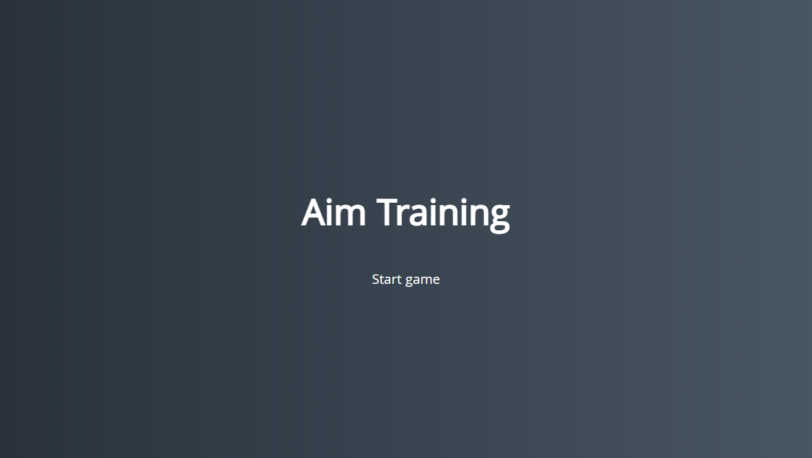
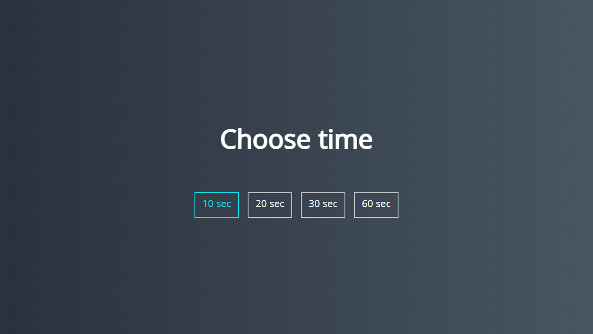
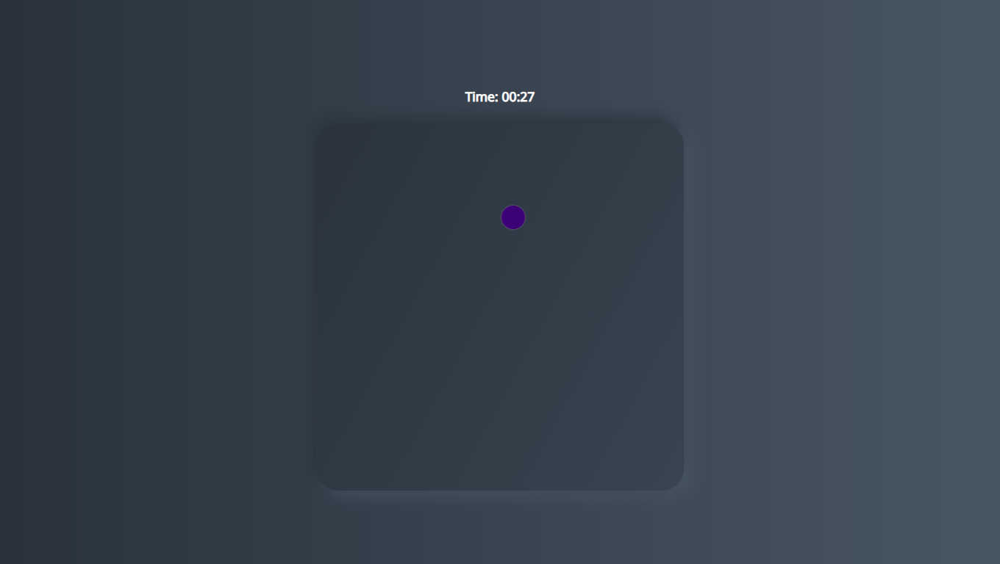

# **AIM Game**

## **Source map**

- src
  - assets
  - scripts
    - app.js
    - createRandCircle.js
    - createRandColor.js
    - createRandSize.js
    - screens.js
    - vars.js
  - main.css
- index.html
- README.md

[Project](https://hov001.github.io/equalizer/)
